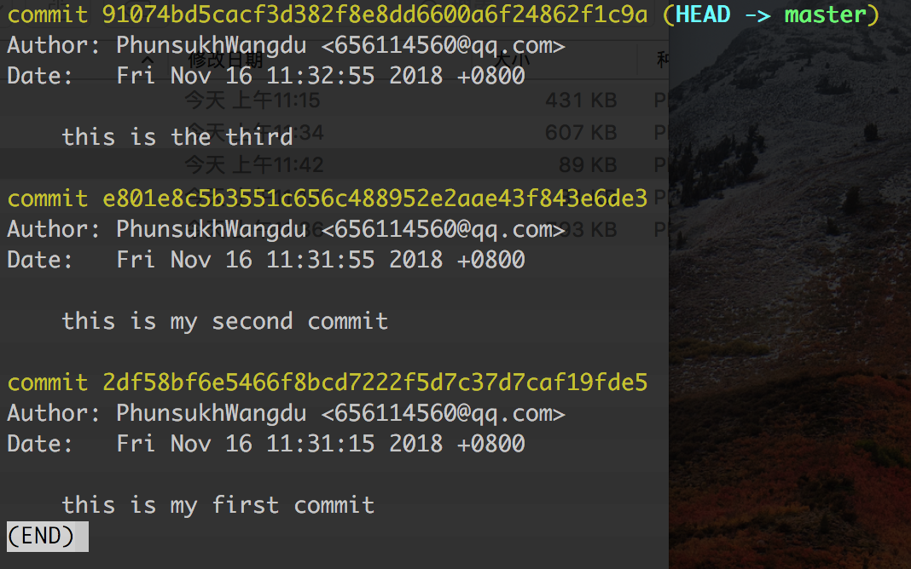
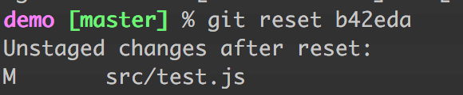
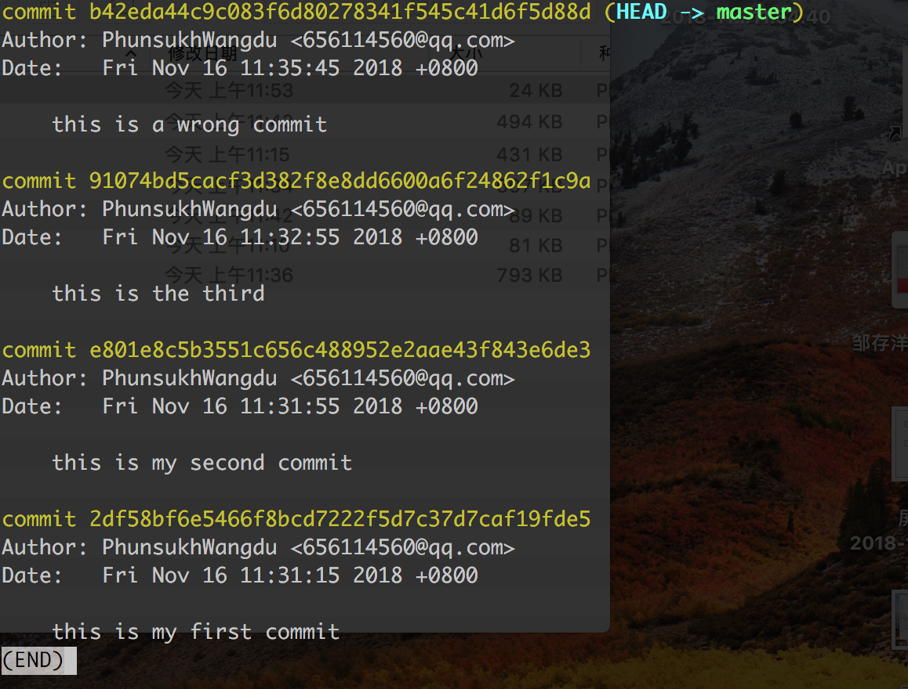

### 进入正文前插个楼，因为vim的操作下面会频繁用到
------
#### vim的操作 ####

1.输入i进入插入模式，对上一条commit信息的内容进行修改

2.按下ESC键，退出编辑模式，切换到命令模式。 

3.保存修改并且退出 vim："ZZ"或者":wq" 

4.保存文件，不退出vim：":w"

5.放弃修改并退出vim：":q!"

6.放弃所有文件修改，但不退出 vi：":e!"

-----

正文，接文章（上）...

## 修改被rebase分支的历史记录

#### 涉及到的命令： rebase -i /git rebase --continue /git rebase --abort ####

接着上，我们继续说下这个rebase。如果我们想在rebase的过程中对一部分提commit交进行修改，可以在'git rebase'命令中加入'-i'或'--interactive'参数去调用交互模式

假设我们要将feature1上的commit记录的基础点重设为master分支的最后一条，同时希望修改我们接到master后面的feature1上的提交信息。

看下feature1上的commit记录，倒数第三条是master上的提交，那次提交便是feature1在master上的基础点：

我们在feature1上执行：

	git rebase -i master

接着我们进入了编辑页面，顶部列出了将要「被 rebase」的所有 commit记录，也就是我们从master分支checkout出feature1分支后的两条提交记录。这个排列是正序的，和log显示的顺序相反

pick的意思是直接应用，我们如果要修改某次的提交信息，需要把提交信息修改成edit，这样在应用到这条commit记录时，Git会停下来让我们修正，假设我们要对这两条commit提交信息分别修改，在vim下讲两个pick改成eidt，然后输入"：wq!保存并退出"

这里Git在执行到"feature1 first commit"便停了下来，提示我们可以通过amend来修改这条commit记录，amend就是用来修改HEAD所指向的这条最新记录，这个具体下面会讲,我们输入git commit --amend，然后进入编辑页面修改上条commit信息，保存：

	git rebase --continue 继续执行rebase
	git rebase --abort 退出rebase过程

这次我们停在了第二条我们要edit的commit记录，同上面的操作

执行成功后，log看下commit记录：

修改成功。

#### 修改当前分支的历史记录

对历史commit记录修改的功能，不仅适用在需要合分支的时候，我们也可以在当前分支进行原地操作，直接对当前分支历史错误的提交记录进行修改。

提交信息多了个t，假设我们要对这条commit记录进行更改，执行：

	git rebase -i HEAD^^^ //也可以是HEAD~3

Git 中有两个「偏移符号」： ^ 和 ~，插楼说下

-----

**^ 的用法**：表示对当前指针指向的commit记录向前便宜，偏移数量就是^的数量，例如：	HEAD^^^，表示的是HEAD所指向的那个commit往前三个的那条commit记录，也就是图中圈出来我们要修改的那个commit前面的那个commit

**~ 的用法**：同样是当前指针的基础上往回偏移，偏移数量就是~后跟着的数字，例如：HEAD~3，表示的同样是图中错误的commit前面的那个

-------
记得我们文章上说过rebase吗，它其实是对分支重设基础点的一个操作，在对别的分支操作时，会找被rebase的分支和要rebase到的分支两个分支的交点，也就是被rebase的分支的一个基础点，分叉点，然后对从基础点分叉出来的提交重新设置为要rebase到的分支最新一条记录

所以这里git rebase -i HEAD^^^，rebase后面跟着的是一个自己分支的某个提交记录，实际上就是对rebase -i 后面跟着的那条记录开始（不包括）往后的所有commit重新设置基础点，把这些commit复制一遍再接在这个新的基础点后面（不太贴切，但是原谅我真的找不到更好理解的话了），对于文件历史变化来说，这个其实就是空操作

## 替换最近一条commit信息

#### 涉及到的命令： git commit --amend####

git commit --amend是对上一条commit命令进行修正。当我们执行这条命令时时，Git会把当前暂存区的内容和这次commit的新内容合并创建一个新的commit，把我们当前HEAD指向的最新的commit替换掉。例如我们当前最新一条commit记录中，我们输入错了提交信息，想要修改，又或者我们提交错了一点东西，又不想生成一个新的commit记录，我们都可以使用这个命令。

这里假设我们需要修复一个上次提交错的文件，同时想修改上一个commit的信息

在我们修复了错误文件test.js后,执行：

	git add src/test.js

然后我们commit这条修改：

	git commit --amend

接着我们又一次进入commit的提交信息编辑页面

回忆一下vim的操作哈，修改完保存退出，执行命令：

看下我们的commit记录

amend用于修改上一条commit信息时，实际上并不是对上一个commit修改，而是生成新的对它进行替换。我们看第一张图我们操作的那条commit修改之前，和我们修改后生成的新的commit，id是完全不一样的（文章上介绍过生成方式），是两个不同的commit

所以这个时候如果我们对已经push到远端的commit记录在本地仓库进行--amend操作之后，直接push到远端仓库是不会成功的，因为本地丢失了远端仓库那个我们替换的commit

当然如果你啥也不改直接保存，那就相当于空操作嘛，老的commit就不会被替换了，还是它本身

## 丢弃之前的提交

#### 涉及到的命令： git reset####

最新一次的commit的内容有问题，想要丢弃这次提交，先log看下提交记录：

【21】

如果想要恢复到最新一次前面的那次commit记录，也就是the third，执行：

	git reset --hard HEAD^

head指向最新的一个commit，也就是途中的wrong commit,^标识从当前位置向前数，有几个就是向前数几个，所以上面的命令的意思就是恢复到head对应的的commit前面的commit，也就是the third。

执行结果：

这时我们git log看下commit的记录：

同理如果要恢复到head前面的第二个commit，也就是the second,在head后两个^:

	git reset --hard HEAD^^
	
被撤销的那条提交并没有消失，只是log不再展现出来，因为已经被丢弃。如果你在撤销它之前记下了它的 SHA-1 码，那么还可以通过这个编码找到它，执行如下：

再log看下commit记录，wrongcommit已经重新出现在记录里，并且head指向它：

	git reset --hard 目标commit

参考文章：
https://www.jianshu.com/p/4f8b56d0fd5b
http://gitbook.liuhui998.com/4_2.html
https://blog.csdn.net/andyzhaojianhui/article/details/78072143