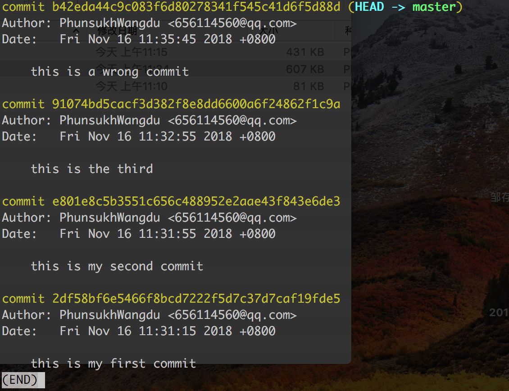

##丢弃之前的提交reset --hard

最新一次的commit的内容有问题，想要丢弃这次提交，先log看下提交记录：

如果想要恢复到最新一次前面的那次commit记录，也就是the third，执行：

	git reset --hard HEAD^

head指向最新的一个commit，也就是途中的wrong commit,^标识从当前位置向前数，有几个就是向前数几个，所以上面的命令的意思就是恢复到head对应的的commit前面的commit，也就是the third。

执行结果：

这时我们git log看下commit的记录：

同理如果要恢复到head前面的第二个commit，也就是the second,在head后两个^:

	git reset --hard HEAD^^
	
被撤销的那条提交并没有消失，只是log不再展现出来，因为已经被丢弃。如果你在撤销它之前记下了它的 SHA-1 码，那么还可以通过这个编码找到它，执行如下：

再log看下commit记录，wrongcommit已经重新出现在记录里，并且head指向它：

	git reset --hard 目标commit

参考文章：
https://www.jianshu.com/p/4f8b56d0fd5b
http://gitbook.liuhui998.com/4_2.html
https://blog.csdn.net/andyzhaojianhui/article/details/78072143