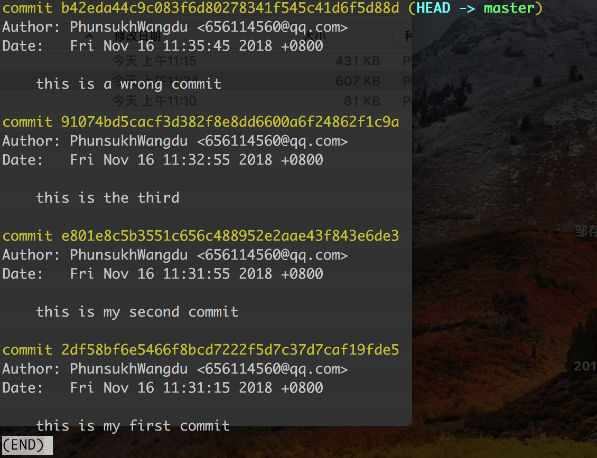
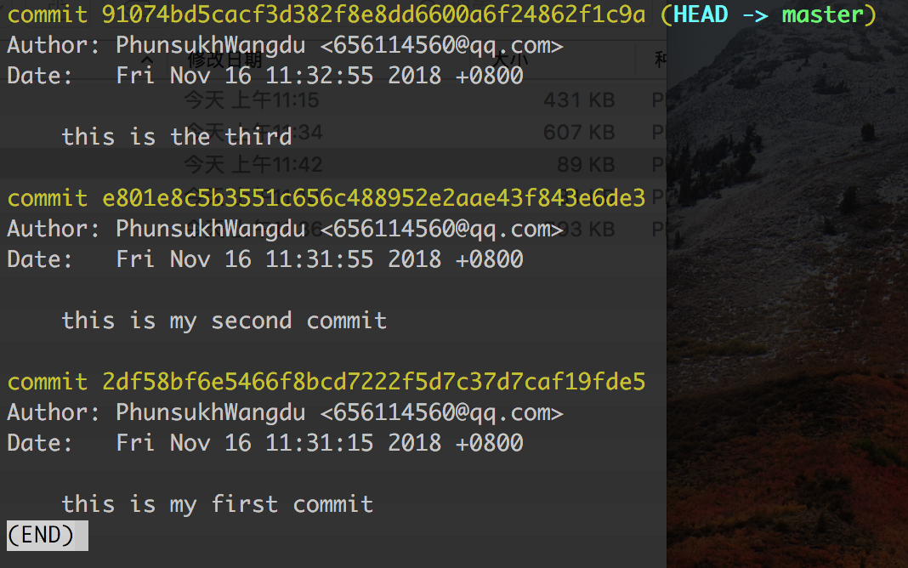
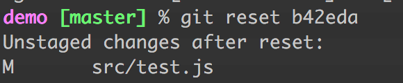
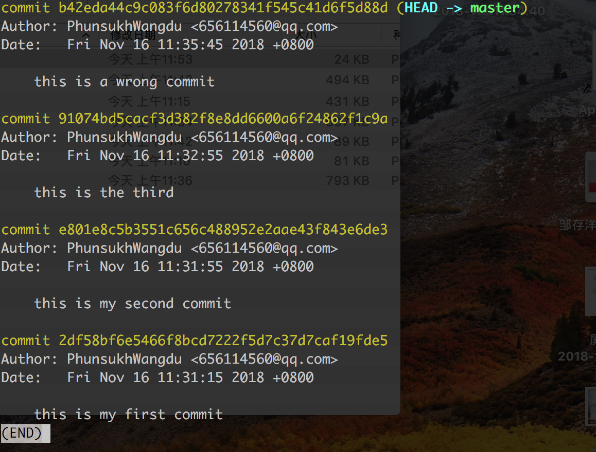

#Git

历史：Linus的作者创建了开源的Linux，02年以前代码管理都依赖手动合并，后来管理不了了，拒绝SVN和CVS这些中央式版本控制的工具(原因如下表格)，采用免费授权给Linux社区的BitKeeper工具，再后来05年社区的大牛要破解BitKeeper被人家公司发现要收回BitKeeper对Linux的免费的使用权，Linus一口气两周内用C写了一个分布式的版本控制系统——Git。接着08年GitHub问世，利用Git为无数开源项目提供代码的托管存储

分布式版本控制系统：Git,BitKeeper

集中式版本控制系统：CVS,SVN

差别：

|    |      集中式（SVN）      |  分布式（Git） |
|----------|:-------------:|------:|
|代码保存|项目要开发完推送给中央服务器。|开发人员在本地仓库存储提交代码修改的历史|
| 网络 |必须要联网才能工作，文件过大或者网速不好会很慢甚至失败。|没有网络的情况下也可以在本地仓库执行commit、查看版本提交记录、以及分支操作，在有网络的情况下执行 push到Remote Repository远端仓库。
|文件存储格式|按照原始文件存储，体积较大|按照元数据方式存储，体积很小|
|版本号|有|无|
|分支操作的影响|创建新的分支则所有的人都会拥有和你一样的分支，本质上是因为都在中央仓库上操作|分支操作不会影响其他开发人员|
|提交|提交的文件会直接记录到中央版本库|提交是本地操作，需要执行push操作才会到远端仓库|

*特别注意，分布式版本控制系统的远端仓库，有时候也被叫“中央服务器”，不同于集中式的中央服务器，分布式中它可以理解成一个中转站，用来协作同步各个本地仓库的代码，实际上任何一个服务器都可以取代它的作用，只是为了方便大家“交换”代码*

##clone远程仓库、创建本地仓库

	git clone https://github.com/****.git 

clone项目到本地之后，我们可以看到目录下有一个叫.git的隐藏文件

这个.git文件夹就是我们的本地仓库（Local Repository）.git文件夹所在的根目录就是我们的工作目录（Working Directory）

clone下来的项目我们就可以正常开发了，当然我们也可以在本地直接创建一个本地仓库，之后再与远程创建的仓库进行关联，先执行

	git init
命令执行的目录下就有了一个.git文件夹，我们在创建了一个本地仓库，接着与远程仓库进行关联：

	git remote add origin https://github.com/****.git 

需要注意，如果你在远程仓库上创建了一个新的项目时勾选了自动生成readme/.gitignore，经常会遇到本地仓库无法提交的情况。这通常是因为我们创建远程仓库时勾选的readme/.gitignore是远程仓库的第一次commit，我们从本地仓库第一次向远程仓库push代码前，没有pull一下远程仓库的代码，本地没有readme/.gitignore文件，所以无法提交成功。所以要先pull再push，当然如果你创建远程仓库时不勾选readme/.gitignore就可以直接push上去

##提交

创建一个文件夹，添加新的文件

	git status //查看工作目录当前状态

untracked files表示未追踪的文件，就是新创建的src文件夹，未追踪的意思就是当前本地git仓库对它没有任何的记录，对本地仓库来说是不存在的，在我们提交代码的时候也不会提交上去

	git add 文件 //将新创建的文件添加到工作目录追踪范围之内

执行之后没有任何提示，执行git status看下当前本地仓库的状态：

新添加的文件进入暂存区，从untracked未跟踪状态变为stage已暂存状态。

##工作目录 暂存区 版本库

**工作目录（working directory）**就是我们创建的项目文件夹，我们开发项目的地方，.git所在根目录

	新创建的文件要添加到暂存区——git add

**暂存区（index/staging area）**是指储存了所有待提交的改动的地方，只有在暂存区存在的文件，本地仓库才会追踪到它的变化。存储在.git文件夹中的index中，是一个二进制文件，可以理解为一个索引，内容包括根据文件名，文件模式和元数据进行排序的文件路径列表，每个路径都有权限以及Blob类型的SHA-1标识符（就是我们平时提交记录对应的那一串编码，下面会讲到

	把文件从暂存区提交到本地的版本库中——git commit

版本库，可以理解为我们本地的代码版本库，实质上是一个指针，存储在.git下的head，git为我们自动生了一个分支master，head就指向这个分支

	git diff 比较的是工作区和暂存区的差别
	git diff HEAD 可以查看工作区和版本库的差别
	git diff --cached 比较的是暂存区和版本库的差别

##丢弃之前的提交reset --hard

最新一次的commit的内容有问题，想要丢弃这次提交，先log看下提交记录：

如果想要恢复到最新一次前面的那次commit记录，也就是the third，执行：

	git reset --hard HEAD^

head指向最新的一个commit，也就是途中的wrong commit,^标识从当前位置向前数，有几个就是向前数几个，所以上面的命令的意思就是恢复到head对应的的commit前面的commit，也就是the third。

执行结果：

这时我们git log看下commit的记录：

同理如果要恢复到head前面的第二个commit，也就是the second,在head后两个^:

	git reset --hard HEAD^^
	
被撤销的那条提交并没有消失，只是log不再展现出来，因为已经被丢弃。如果你在撤销它之前记下了它的 SHA-1 码，那么还可以通过这个编码找到它，执行如下：

再log看下commit记录，wrongcommit已经重新出现在记录里，并且head指向它：

	git reset --hard 目标commit

