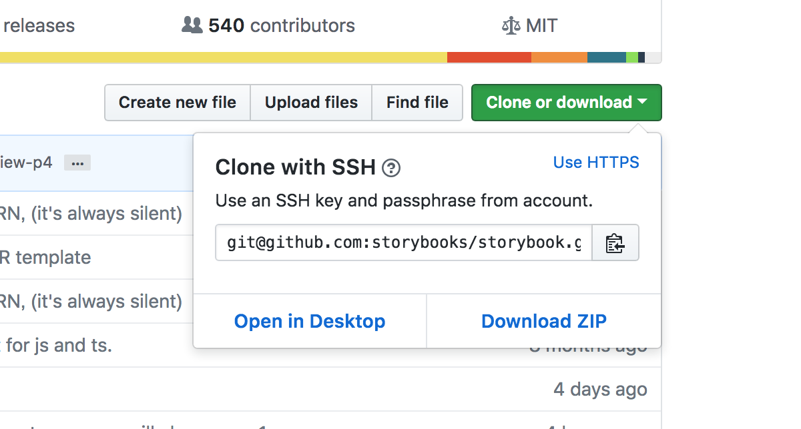

#Git

历史：Linus的作者创建了开源的Linux，02年以前代码管理都依赖手动合并，后来管理不了了，拒绝SVN和CVS这些中央式版本控制的工具(原因如下表格)，采用免费授权给Linux社区的BitKeeper工具，再后来05年社区的大牛要破解BitKeeper被人家公司发现要收回BitKeeper对Linux的免费的使用权，Linus一口气两周内用C写了一个分布式的版本控制系统——Git。接着08年GitHub问世，利用Git为无数开源项目提供代码的托管存储

分布式版本控制系统：Git,BitKeeper

集中式版本控制系统：CVS,SVN

差别：

|    |      集中式（SVN）      |  分布式（Git） |
|----------|:-------------:|------:|
|代码保存|项目要开发完推送给中央服务器。|开发人员在本地仓库存储提交代码修改的历史|
| 网络 |必须要联网才能工作，文件过大或者网速不好会很慢甚至失败。|没有网络的情况下也可以在本地仓库执行commit、查看版本提交记录、以及分支操作，在有网络的情况下执行 push到Remote Repository远端仓库。
|文件存储格式|按照原始文件存储，体积较大|按照元数据方式存储，体积很小|
|版本号|有|无|
|分支操作的影响|创建新的分支则所有的人都会拥有和你一样的分支，本质上是因为都在中央仓库上操作|分支操作不会影响其他开发人员|
|提交|提交的文件会直接记录到中央版本库|提交是本地操作，需要执行push操作才会到远端仓库|

*特别注意，分布式版本控制系统的远端仓库，有时候也被叫“中央服务器”，不同于集中式的中央服务器，分布式中它可以理解成一个中转站，用来协作同步各个本地仓库的代码，实际上任何一个服务器都可以取代它的作用，只是为了方便大家“交换”代码*

##clone项目

	git clone 图中的项目地址

如果你在远程仓库上创建了一个新的项目，并且勾选了自动生成readme，经常会遇到本地仓库无法提交的情况。这通常是因为你第一次push前没有pull一下远程仓库的代码，本地没有readme这个文件，所以要先pull再push，当然如果你不创建readme就可以直接push上去

##丢弃之前的提交reset --hard

最新一次的commit的内容有问题，想要丢弃这次提交，先log看下提交记录：

如果想要恢复到最新一次前面的那次commit记录，也就是the third，执行：

	git reset --hard HEAD^

head指向最新的一个commit，也就是途中的wrong commit,^标识从当前位置向前数，有几个就是向前数几个，所以上面的命令的意思就是恢复到head对应的的commit前面的commit，也就是the third。

执行结果：

这时我们git log看下commit的记录：

同理如果要恢复到head前面的第二个commit，也就是the second,在head后两个^:

	git reset --hard HEAD^^
	
被撤销的那条提交并没有消失，只是log不再展现出来，因为已经被丢弃。如果你在撤销它之前记下了它的 SHA-1 码，那么还可以通过这个编码找到它，执行如下：

再log看下commit记录，wrongcommit已经重新出现在记录里，并且head指向它：

	git reset --hard 目标commit

