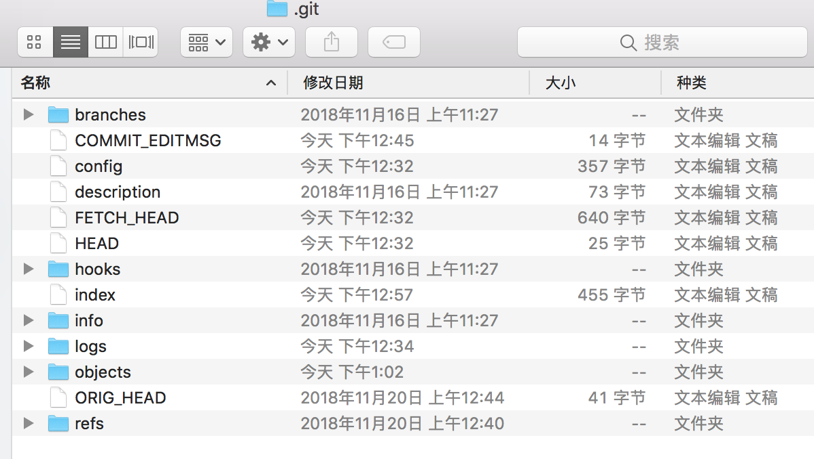
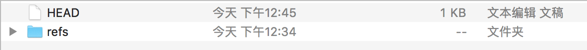
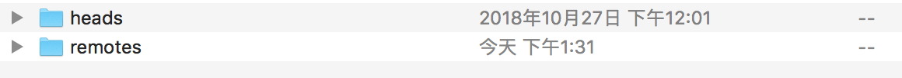
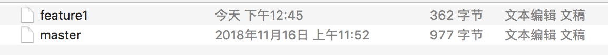
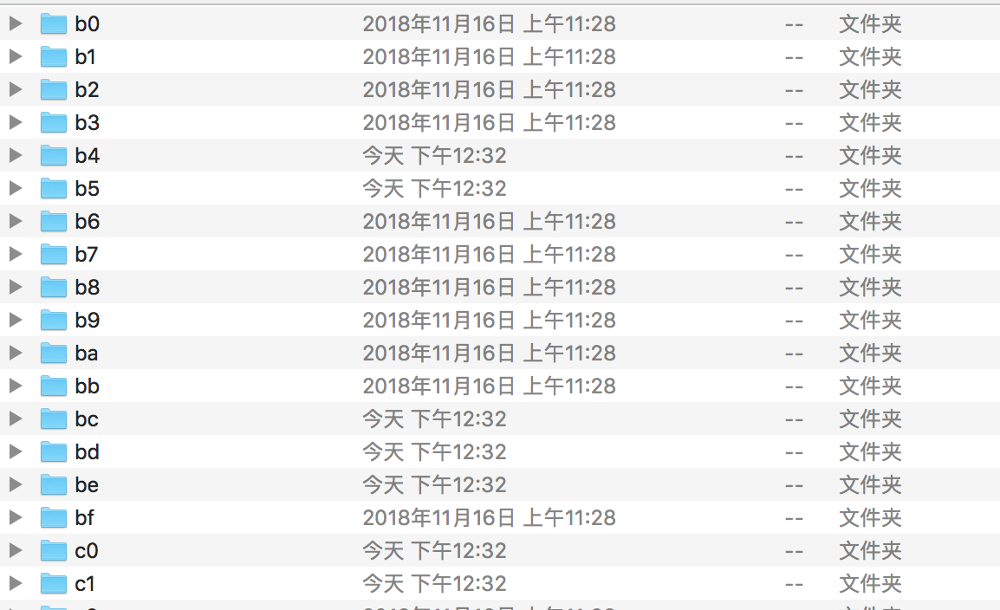
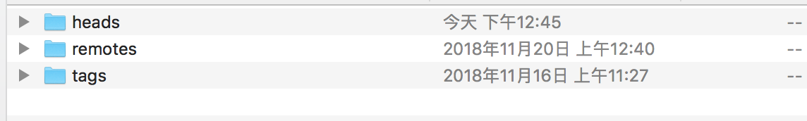
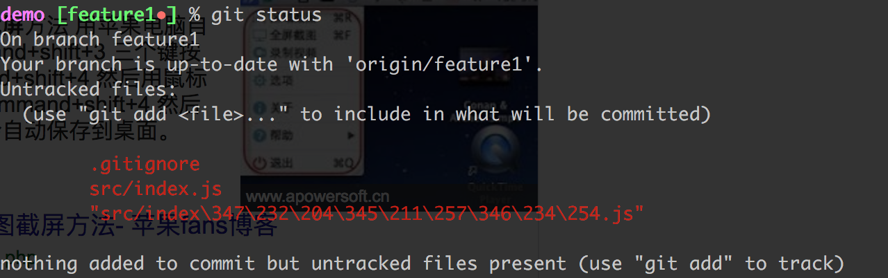
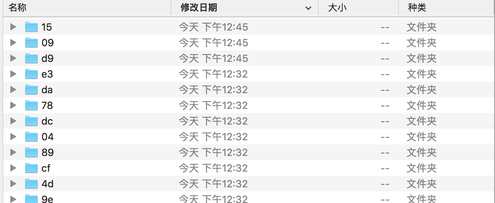
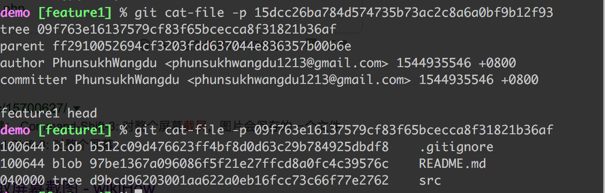
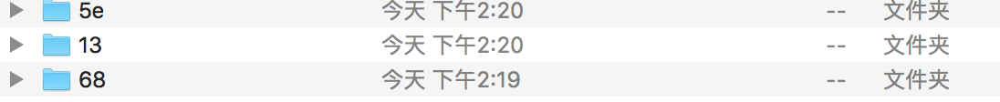

### .git

#### .git文件夹中的内容及作用

打开.git文件夹后：

通常有五个文件夹：

* hooks文件夹，用于存储shell脚本，当执行某些git指令后，会触发存储在该文件夹下指定的shell脚本
* info文件夹，用于存储该项目仓库的相关信息
* logs文件夹：

	* HEAD: 用于记录提交记录,和git reflog显示的内容一致
	* refs:
	
		* heads: 
		
		本地仓库的分支 以及其提交记录
		* remotes: 内部有我们设置的origin，远程仓库的分支
		
* objects文件夹：
	
	“key-value数据库”,key是根据内容生成的一个40位的SHA-1编码值，但是在objects中会把前两位提取用于区分文件夹，来快速查找，剩余38位作为文件名，文件内容有两种形式，Tree对应的是当时目录结构的一个快照，Blob则是文件内容
* refs文件夹：
	
	用于记录每个分支的最新提交结点以及tags，heads和remotes和logs中的refs中一致
* HEAD ref: refs/heads/master
* index: 
	* 二进制的文件形式，储存当前暂存区的文件的索引，这些索引都在Objects里面，但是因为当前还未commit，没有生成当前状态的tree的快照，无法快速对应到每个文件的状态快照，所以index中存储的是另外一种可以索引到Objects中相应文件快照的路径方式，另外这种索引方式是要快于tree
	* reset --hard objects里面的新生成的记录并不会丢

我们需要着重关注logs文件夹、objests文件夹以及refs文件夹，通过这三个文件夹所存储的内容来分析git。在.git文件夹中，同样存在有一些文件，譬如HEAD、config、index等文件，其中HEAD文件用以记录当前仓库指向的项目提交结点，config文件中记录着仓库的配置信息，index是暂存区的内容。

#### add操作到commit .git的变化

我们将改变add进入暂存区，此时.git文件夹中的index的内容发生变化，我们的改变已经添加到暂存区。此时Objects中没有任何改变

接着我们commit，这时Objects文件发生变化

增加了三条记录，我们看下我们commit的信息

可以看到我们新增加的内容包括以b5,97,d9开头的id记录（Blob),同时包括以09和15开头的id记录（Tree)

文件夹新增记录中没有b5，是因为之前的提交记录中有生成开头为b5的id，我们找到b5的文件夹，可以看到里面有一个叫12c09...也就是对应我们本次提交的.gitignore文件的那个id的文件，修改时间为add操作对应的时间，并不是commit时

看到19和20的时间差了么，19是我们add操作为修改的文件新生成的文件内容快照，20是我们commit操作新生成的目录结构tree快照

tree和Blob，都是2进制存储的，头不同，表达不同的存储内容，.git会知道这是一个tree还是Blob

#### objects
git系统中有三个实体，即“提交结点”、“节点内容”、“文件内容”。

objects可以认为是一种“key-value数据库”，之所以将数据库打引号，是因为这个“git的数据库”不具备数据库的基本功能，而仅仅具备可以通过key值能够找到与之对应的value。

**提交结点实体**

是整个git中的核心实体，提交节点中描述了提交节点之间的继承关系，即本次提交的内容是基于哪个或哪几个之前的提交的内容，提交结点实体之间的关系形成了一个DAG图，通过这个DAG图可以清晰地理顺整个项目的发展脉络，提交节点的内容如下：

	tree <SHA1-signature>
	[
	    parent <SHA1-signature>
	    ...
	]
	author <author name> <\<author email\>> <timestamp> <time zone>
	committer <committer name> <\<committer email\>> <timestamp> <time zone>

	<commit message>

* tree用于指向与该提交结点实体关联的节点内容实体。
* parent用于指向该提交节点实体所基于的之前的提交结点实体，可以看到，parent可以是多个。
* author用于记录本次提交的作者姓名、作者邮箱、作者所添加的内容时间以及时区
* committer用于记录本次提交的提交者姓名、邮箱等内容。
* commit message用于记录当前提交的消息日志。

**节点内容实体**

用于记录本次提交时，提交中所包含的所有文件名，以及文件名所对应的key值。

注意，可能由于查询性能的缘故，**并非是仅记录本次提交时修改的文件，而是记录本次提交时所有的文件**。

**文件内容实体**

用于记录具体的文件内容。也就是说，在一个git仓库中，并非只有程序员们所能看到的当前项目文件夹下的代码版本，**包括所有的历史代码都会在.git文件夹中有一个备份**。

在objects文件夹中，三种数据实体无差别的以key-value的形式进行存储。因此一次提交操作，在objects文件夹中至少生成两个文件。

存储时采用**deflate算法对原始文件内容进行压缩**，而**key值是根据原始文件内容、文件大小等数据生成的消息摘要**

在当前版本的git中，消息摘要生成算法采用SHA1算法，生成过程是将文件格式与文件长度组成头部，将文件内容作为尾部，由头部和尾部拼接后作为原文，经过SHA1算法计算之后得到该文件的160位长的SHA1签名。为防止一个文件夹内的文件数量过多，将签名每四位用字符表示十六进制数，于是得到一个长度为40的字符串，将字符串的前两个字符作为文件夹，后38个字符作为文件名进行存储。

观察仔细的同学可以发现，在三个实体的内容里，没有任何一个字段提供分支概念的信息

#### logs

该文件夹下的内容是一条分支下的所有提交节点实体序列。在该文件夹下，文件内容格式是单一的，即形如这样：

	0000000000000000000000000000000000000000 6a0fa53d78f03abea3439b9213123d1f260f5beb author <mail> 1511776312 +0800    commit (initial): master 1
	6a0fa53d78f03abea3439b9213123d1f260f5beb 75642040a2da5b324befde7ca8531b3426b32ba7 author <mail> 1511776323 +0800    commit: master 2
	
在一个分支创建时，无论这个分支是master还是基于某个提交结点创建的子分支，在logs文件中关于分支的时间线总是以全0的值为开始的。我们需要关注这样几个问题：

master在初始化时是否会创建一个起始地提交结点？
分支创建时的是否会创建一个新的提交节点？

通过 git init创建一个初始化的git仓库时，master是默认创建的，在初始化的git仓库中，.git文件夹中是不存在logs文件夹的，且在objects文件夹中不包含任何key-value键值对，甚至不存在一个实际存在的master主分支，因此所谓的**master初始化并非是在git仓库初始化时进行的，而是在首次提交时进行的**。在测试项目中，我在以75为开头的提交结点时创建了一个子分支，查看子分支的logs文件内容：

	0000000000000000000000000000000000000000 75642040a2da5b324befde7ca8531b3426b32ba7 author <mail> 1511776334 +0800    branch: Created from HEAD

可以看到，子分支创建时并非将主分支上分叉节点复制一下，而是从这个节点起即为一个子分支。

当合并分支时，logs的日志是如何表现**，事先需要明确的是，合并分支等价于一次提交（合并分支会生成一个提交结点实体）**。

参考： https://www.cnblogs.com/gscienty/p/7904518.html