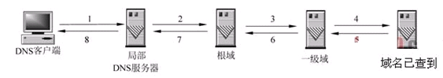

## 从输入url到页面展示到底发生了什么

#### 输入地址

1. 浏览器查询url的域名
2. 查询浏览器的DNS缓存
3. 浏览器缓存中没有，则查找本地hosts文件中是否有对应的ip地址
4. 本地hosts也没有，则查找本地DNS服务器（运营商提供）
5. 查询你输入的网址的DNS请求到达本地DNS服务器之后，本地DNS服务器会首先查询它的缓存记录，如果缓存中有此条记录，就可以直接返回结果
5. 如果没有，本地DNS服务器**递归**向根服务器查找域名对应的ip，从顶级域名（.com）开始，一步步缩小范围，得到对应的ip
6. 根DNS服务器没有记录具体的域名和IP地址的对应关系，而是告诉本地DNS服务器，你可以到**域服务器**上去继续查询，**并给出域服务器的地址**。这种过程是**迭代**的过程。
7. 本地DNS服务器继续向域服务器发出请求，在这个例子中，请求的对象是.com域服务器。.com域服务器收到请求之后，也不会直接返回域名和IP地址的对应关系，而是告诉本地DNS服务器，你的**域名的解析服务器的地址**。
8. 最后，本地DNS服务器向**域名的解析服务器发出请求**，这时就能收到一个域名和IP地址对应关系，本地DNS服务器不仅要把IP地址返回给用户电脑，还要把这个对应关系保存在缓存中，以备下次别的用户查询时，可以直接返回结果，加快网络访问

在浏览器中输入网址的过程中，浏览器其实就已经在智能的匹配可能得 url 了，他会从历史记录，书签等地方，找到已经输入的字符串可能对应的 url，然后给出智能提示，让你可以补全url地址。

对于 google的chrome 的浏览器，他甚至会直接从缓存中把网页展示出来，就是说，你还没有按下 enter，页面就出来了。

----

#### DNS

DNS（Domain Name System，域名系统），**因特网上作为域名和IP地址相互映射的一个分布式数据库**，能够使用户更方便的访问互联网，而不用去记住能够被机器直接读取的IP数串。

#### 域名解析

通过主机名，最终得到该主机名对应的IP地址的过程叫做域名解析（或主机名解析）

因为计算机更容易记住的是ip，而我们更容易记住的是网站名字

#### DNS查询的两种方式：递归查询和迭代查询

1. 递归解析

	局部DNS服务器自己负责向其他DNS服务器进行查询，一般是先向该域名的**根域服务器**查询，再由根域名服务器一级级向下查询。最后得到的查询结果返回给局部DNS服务器，再由局部DNS服务器返回给客户端。
	
	
	
2. 迭代解析

	局部DNS服务器不是自己向其他DNS服务器进行查询，而是**把能解析该域名的其他DNS服务器的IP地址返回给客户端DNS程序**，客户端DNS程序再继续向这些DNS服务器进行查询，直到得到查询结果为止。
	
	迭代解析只是帮你找到相关的服务器而已，而不会帮你去查。

 	
 	

#### 

