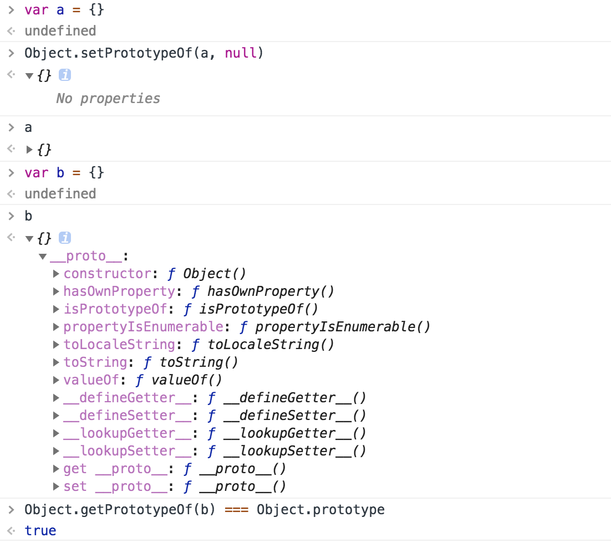
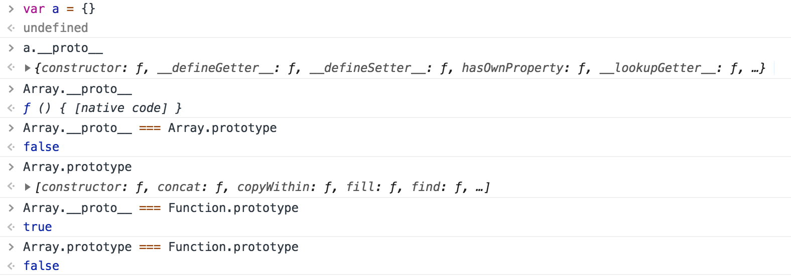
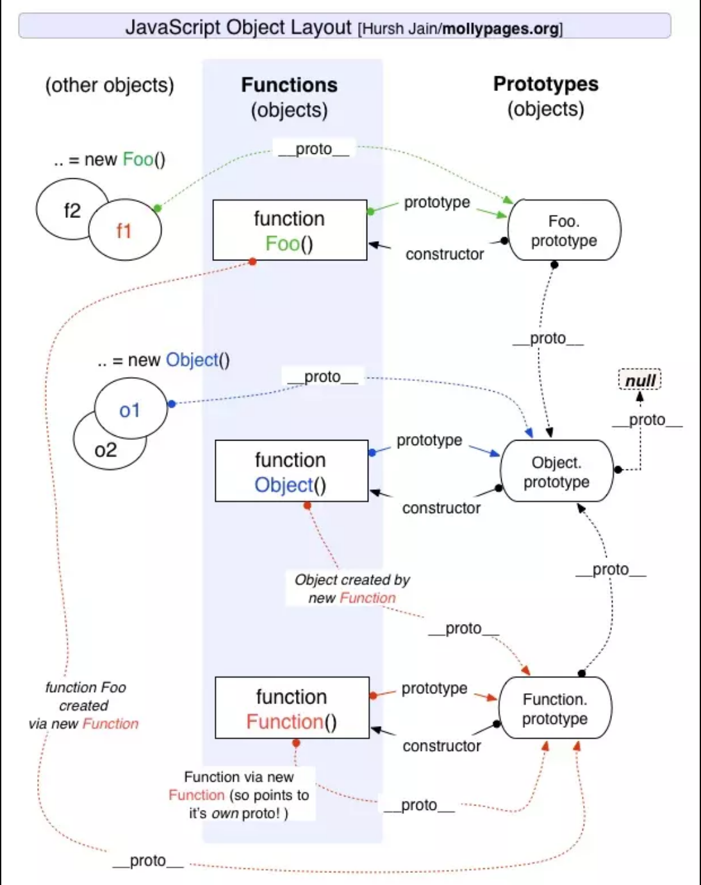

## prototype和__proto__

	Object.getPrototypeOf(Array) === Function.prototype //true
	Object.getPrototypeOf({}) === Object.prototype //true
	

	Object.getPrototypeOf(null) === Object.prototype
	VM897:1 Uncaught TypeError: Cannot convert undefined or null to object
	    at Function.getPrototypeOf (<anonymous>)
	    at <anonymous>:1:8

	Object.getPrototypeOf([]) === Object.prototype
	false
	Object.getPrototypeOf([]) === Array.prototype
	true
	Object.getPrototypeOf([]) === Function.prototype
	false
	Object.getPrototypeOf(Array.prototype) === Object.prototype
	true
	Object.getPrototypeOf(Array) === Function.prototype 
	true

函数的原型，指向Function.prototype
构造函数实例化的对象，原型指向构造函数的原型，而构造函数的原型是Fcuntion.prototype,构造函数原型的原型，指向Object.prototype

	function P(){this.a = 111}
	var p = new P()

	p.__proto__ === P.prototype
	//true
	p.__proto__ === Object.prototype
	//false
	P.prototype === P.__proto__
	//false
	P.prototype === Function.prototype
	//false
	P.__proto__ === Function.prototype
	//true
	p.__proto__ === P.prototype
	//true
	p.__proto__ === P.__proto__
	//false

构造函数的prototype，指向自身对应的原型对象，构造函数实例化的对象的__proto__也都指向这个对象，然而这个对象却不等于构造函数自身的__proto__，构造函数自身的__proto__是指向Function.prototype，所以prototype和__proto__并不是一样的单纯理解成指向原型的东西。

构造函数在作为构造函数的同时，自己也是一个方法，所以它自己作为方法的原型链上，__proto__是指向Function.prototype的。而作为构造方法，由它实例化的对象都有一个共同的原型，P.prototype，这个原型对象是该构造函数生成的实例的原型对象，与该构造函数的原型链没有任何关系，所以对于构造函数的prototype和__proto__千万要区分。

所以任何对象都是有一个__proto__的，函数也不例外，因为函数实际上也是一个对象

