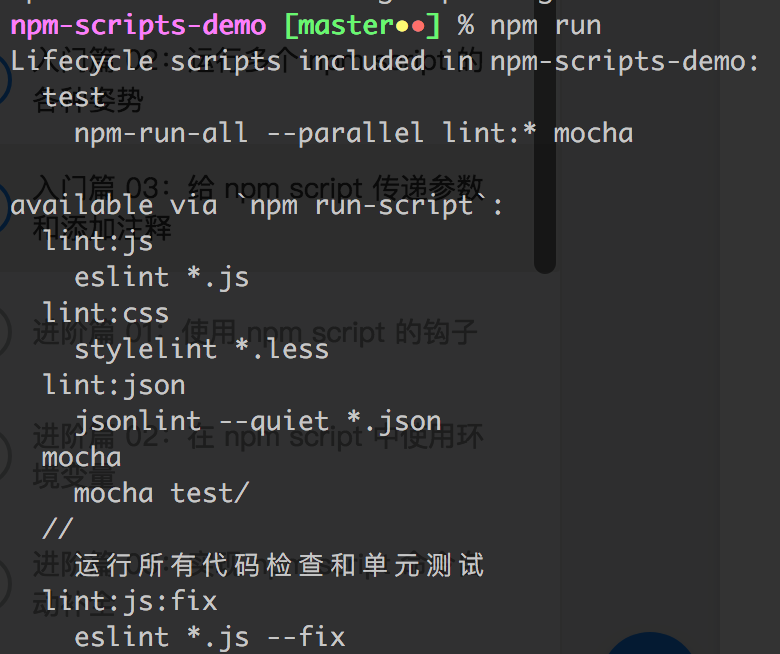
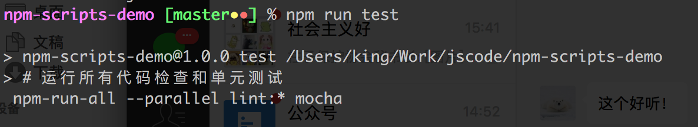
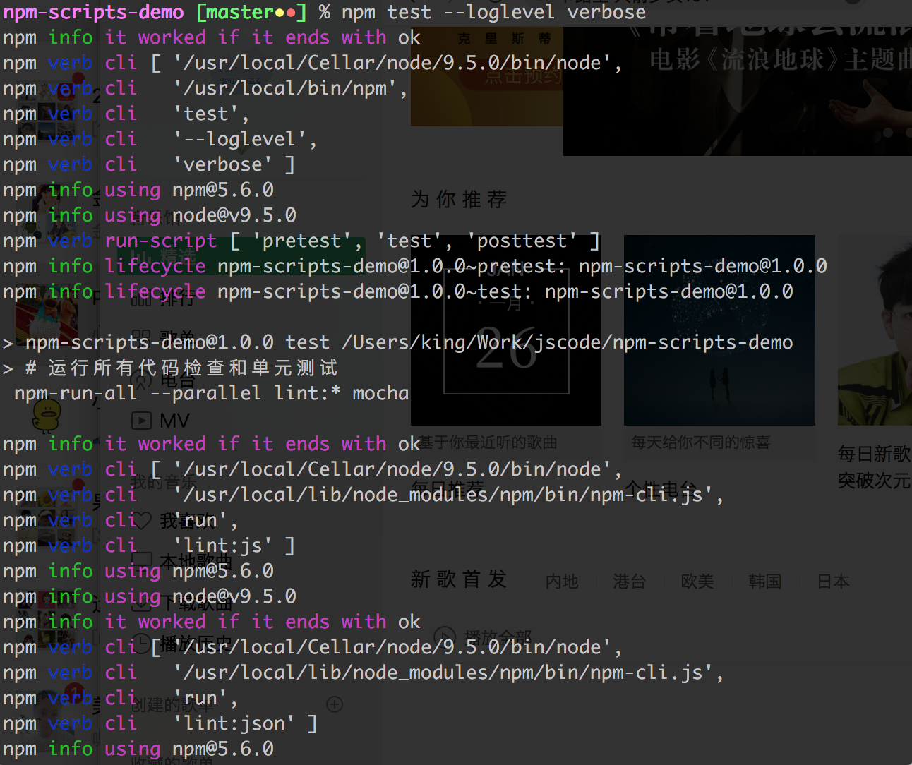

## scripts的命令

#### 多个 npm script 串行 —— &&

	"test": "npm run lint:js && npm run lint:css && npm run lint:json && npm run lint:markdown && mocha tests/"

串行执行的时候如果前序命令失败（通常进程退出码非0），后续全部命令都会终止

#### 多个 npm script 并行 —— &

	"test": "npm run lint:js & npm run lint:css & npm run lint:json & npm run lint:markdown & mocha tests/"

npm 内置支持的多条命令并行跟 js 里面同时发起多个异步请求非常类似，它只负责触发多条命令，而不管结果的收集，如果并行的命令执行时间差异非常大，就会出现运行结果在进程退出后输出的情况

#### 等待输出

在命令的结尾增加 & wait ，可以保证输出结果在进行退出前输出：

	npm run lint:js & npm run lint:css & npm run lint:json & npm run lint:markdown & mocha tests/ & wait

加上 wait 的额外好处是，如果我们在任何子命令中启动了长时间运行的进程，比如启用了 mocha 的 --watch 配置，可以使用 ctrl + c 来结束进程，如果没加的话，你就没办法直接结束启动到后台的进程。

#### npm-run-all 

命令执行工具，实现更轻量和简洁的多命令运行

	npm i npm-run-all -D

**并行：**
	
	"test": "npm-run-all --parallel lint:* mocha"

#### 给 npm script 传递参数

	"lint:js:fix": "eslint *.js --fix",
	
	"lint:js:fix": "npm run lint:js -- --fix",

要格外注意 --fix 参数前面的 -- 分隔符，意指要给 npm run lint:js 实际指向的命令传递额外的参数

#### 给 npm script 添加注释

第一种方式是，package.json 中可以增加 // 为键的值

npm 会忽略这种键

    "mocha": "mocha test/",
    "//": "11",
    "lint:js:fix": "eslint *.js --fix",
    "//": "运行所有代码检查和单元测试",
    "test": "npm-run-all --parallel lint:* mocha"
	    
如果你声明了多个，npm run 只会列出最后那个

另一种方式：

	"test": "# 运行所有代码检查和单元测试 \n npm-run-all --parallel lint:* mocha"

#### npm script 运行时日志输出

**默认日志输出级别**

即不加任何日志控制参数得到的输出

**显示尽可能少的有用信息**

	npm run test --loglevel silent

结合其他工具调用 npm script 的时候比较有用，需要使用 --loglevel silent，或者 --silent，或者更简单的 -s 来控制

如果执行各种 lint script 的时候启用了 -s 配置，代码都符合规范的话，不会看到任何输出

**显示尽可能多的运行时状态**

	npm run test --loglevel verbose

排查脚本问题的时候比较有用，需要使用 --loglevel verbose，或者 --verbose，或者更简单的 -d 来控制

这个日志级别的输出详细打印出了每个步骤的参数、返回值等：

