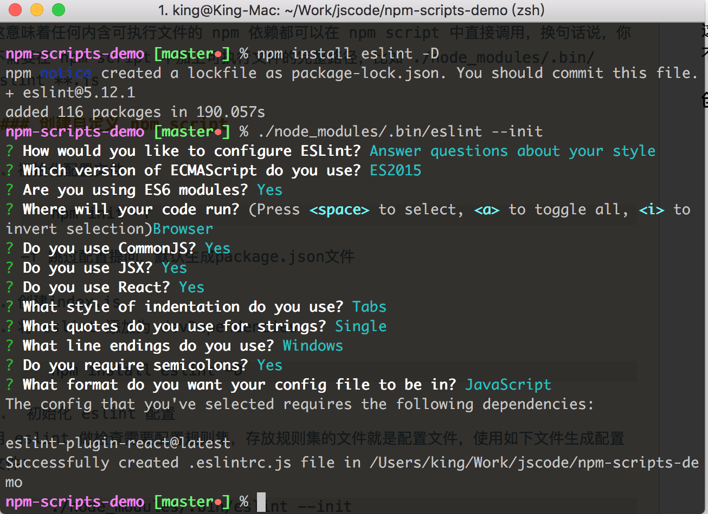
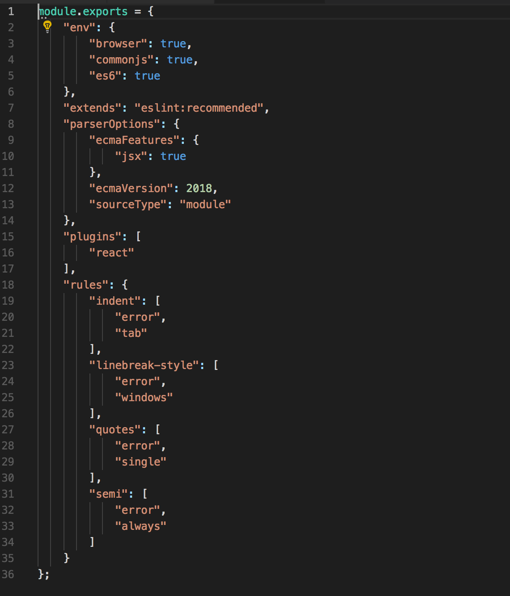
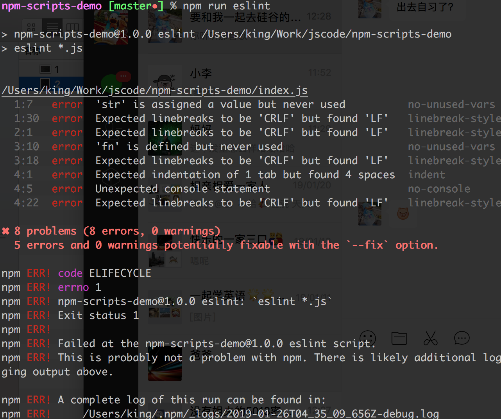

##npm scripts

#### npm 是如何管理和执行各种 scripts 的呢？

作为 npm 内置的核心功能之一，npm run 实际上是 npm run-script 命令的简写。当我们运行 npm run xxx 时，基本步骤如下：

1. 从 package.json 文件中读取 scripts 对象里面的全部配置；
2. 以传给 npm run 的第一个参数作为键，在scripts对象里面获取对应的值作为接下来要执行的命令，如果没找到直接报错；
3. 在系统默认的 shell 中执行上述命令，系统默认 shell 通常是 bash，windows 环境下可能略有不同

#### 命令来自哪里？
npm 在执行指定 script 之前会把 node_modules/.bin 加到环境变量 $PATH 的前面

这意味着任何内含可执行文件的 npm 依赖都可以在 npm script 中直接调用，换句话说，你不需要在 npm script 中加上可执行文件的完整路径，比如 ./node_modules/.bin/eslint **.js

#### 创建自定义 npm script

1. 初始化配置文件
		
		npm init -f
	
	-f 跳过配置提问，默认生成package.json文件

2. 创建index.js
3. 将 eslint 添加为 devDependencies

		npm install eslint -D

4.  初始化 eslint 配置
用 eslint 做检查需要配置规则集，存放规则集的文件就是配置文件，使用如下文件生成配置文件：

		./node_modules/.bin/eslint --init

	回答一些基础配置的问题：
	
	
	
	回车后根目录下出现.eslintrc.js
	
	

5.  在 package.json 的 scripts 字段中新增命令 eslint：

		{
		  "scripts": {
		    "eslint": "eslint *.js",
		    "test": "echo \"Error: no test specified\" && exit 1"
		  },
		}
		
6. 运行eslint: npm run eslint

	