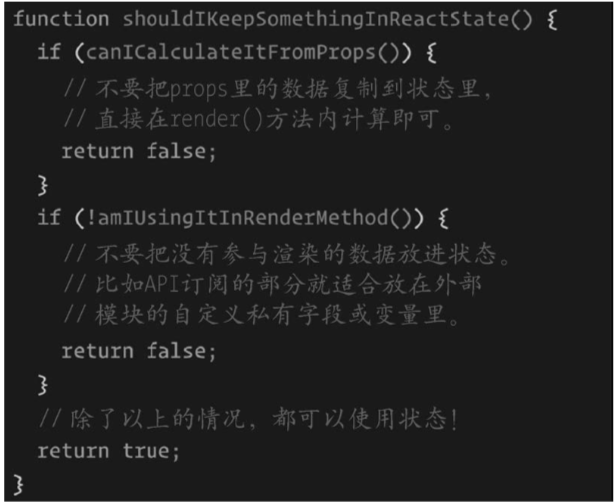

##3.状态

1.每个有状态的react应用都有一个初始状态，可以通过setState方法改变这个状态，react会将新的状态合并到当前对象上，根据新的状态渲染出组件。

setState第二个参数是一个回调函数，在setState完成之后执行，即组件状态更新完成之后执行

	this.setState({
      clicked: true,
    }, () => {
      console.log('the state is now', this.state)
	})
	
setState是异步的，在setState后在控制台立即打出状态，是旧的状态值。因为react知道如何优化事件处理内部的状态更新，进行批处理，获得更好的性能。

（工具react-lumberjack可用来应用和撤销状态的变化，在过程中对状态前进活后退，便与调试 ）

2.将满足需求的最少的数据放在状态中

将记录UI变化的值保存，如果多个层级关系的组件需要追踪同一份数据信息，可以考虑使用层级状态管理工具Redux等

不应该保存在state中的值：
1.可通过props计算出来的值
2.因为设置状态会引发渲染，所以将渲染方法用的到的值才保存在状态中，也就是影响状态的值，改变之后需要让组件重新渲染的值

	

##4.propTypes

用来约定和规范组件的接口，提供组件期望接收到的参数及验证规则，如下：
	
	import PropTypes from 'prop-types';
	
	MyComponent.propTypes = {
	  // 你可以将属性声明为以下 JS 原生类型
	  optionalArray: PropTypes.array,
	  optionalBool: PropTypes.bool,
	  optionalFunc: PropTypes.func,
	  optionalNumber: PropTypes.number,
	  optionalObject: PropTypes.object,
	  optionalString: PropTypes.string,
	  optionalSymbol: PropTypes.symbol,
	
	  // 任何可被渲染的元素（包括数字、字符串、子元素或数组）。
	  optionalNode: PropTypes.node,
	
	  // 一个 React 元素
	  optionalElement: PropTypes.element,
	
	  // 你也可以声明属性为某个类的实例，这里使用 JS 的
	  // instanceof 操作符实现。
	  optionalMessage: PropTypes.instanceOf(Message),
	
	  // 你也可以限制你的属性值是某个特定值之一
	  optionalEnum: PropTypes.oneOf(['News', 'Photos']),
	
	  // 限制它为列举类型之一的对象
	  optionalUnion: PropTypes.oneOfType([
	    PropTypes.string,
	    PropTypes.number,
	    PropTypes.instanceOf(Message)
	  ]),
	
	  // 一个指定元素类型的数组
	  optionalArrayOf: PropTypes.arrayOf(PropTypes.number),
	
	  // 一个指定类型的对象
	  optionalObjectOf: PropTypes.objectOf(PropTypes.number),
	
	  // 一个指定属性及其类型的对象
	  optionalObjectWithShape: PropTypes.shape({
	    color: PropTypes.string,
	    fontSize: PropTypes.number
	  }),
	
	  // 你也可以在任何 PropTypes 属性后面加上 `isRequired` 
	  // 后缀，这样如果这个属性父组件没有提供时，会打印警告信息
	  requiredFunc: PropTypes.func.isRequired,
	
	  // 任意类型的数据
	  requiredAny: PropTypes.any.isRequired,
	
	  // 你也可以指定一个自定义验证器。它应该在验证失败时返回
	  // 一个 Error 对象而不是 `console.warn` 或抛出异常。
	  // 不过在 `oneOfType` 中它不起作用。
	  customProp: function(props, propName, componentName) {
	    if (!/matchme/.test(props[propName])) {
	      return new Error(
	        'Invalid prop `' + propName + '` supplied to' +
	        ' `' + componentName + '`. Validation failed.'
	      );
	    }
	  },
	
	  // 不过你可以提供一个自定义的 `arrayOf` 或 `objectOf` 
	  // 验证器，它应该在验证失败时返回一个 Error 对象。 它被用
	  // 于验证数组或对象的每个值。验证器前两个参数的第一个是数组
	  // 或对象本身，第二个是它们对应的键。
	  customArrayProp: PropTypes.arrayOf(function(propValue, key, componentName, location, propFullName) {
	    if (!/matchme/.test(propValue[key])) {
	      return new Error(
	        'Invalid prop `' + propFullName + '` supplied to' +
	        ' `' + componentName + '`. Validation failed.'
	      );
	    }
	  })
	};

react-Docgen工具可以根据组件的prop类型，为组件生成json结构的api文档，甚至可以获取在代码中添加的注释，对应到生成的json数据中description字段中，例如：

组件：

	/**
	 * A generic button with text.
	 */
	const Button = ({ text }) => <button>{text}</button>
	Button.propTypes = {
	  /**
	   * The text of the button.
	   */
	  text: React.PropTypes.string,
	}

执行react-docgen button.js得到：

	{
	    "description": "A generic button with text.",
	    "methods": [],
	    "props": {
	        "text": {
	            "type": {
	  } }
	        "name": "string"
	    },
	    "required": false,
	    "description": "The text of the button."
	}