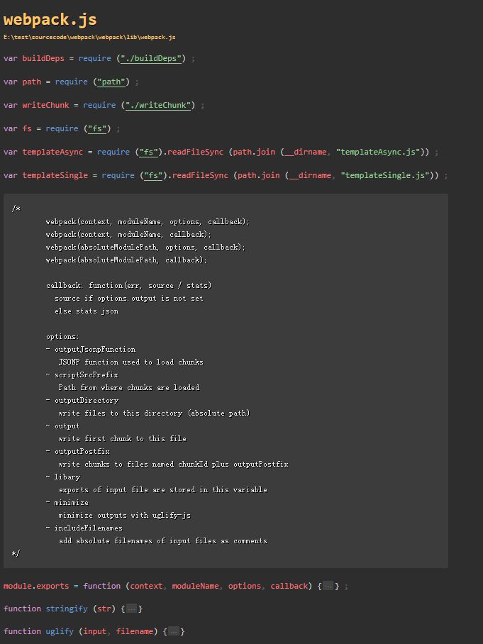

#### webpack的第一次commit做了什么

github地址：[https://github.com/webpack/webpack/tree/2e1460036c5349951da86c582006c7787c56c543](https://github.com/webpack/webpack/tree/2e1460036c5349951da86c582006c7787c56c543)

定位第一次commit的方式：https://blog.csdn.net/zhi_cike/article/details/77981816

#### package.json

	{
		"name": "webpack",
		"version": "0.1.0",
		"author": "Tobias Koppers @sokra",
		"description": "Bundle CommonJS modules into single script or multiple scripts for web browser",
		"dependencies": {
			"esprima": "0.9.8",
			"optimist": "0.2.x",
			"uglify-js": "1.2.5"
		},
		"devDependencies": {
			"vows": "*"
		},
		"engines": {
			"node":  ">=0.1.30"
		},
		"main": "lib/webpack.js",
		"bin": "./bin/webpack.js",
		"licence": "MIT"
	}

#### 入口文件 liv/webpack.js

